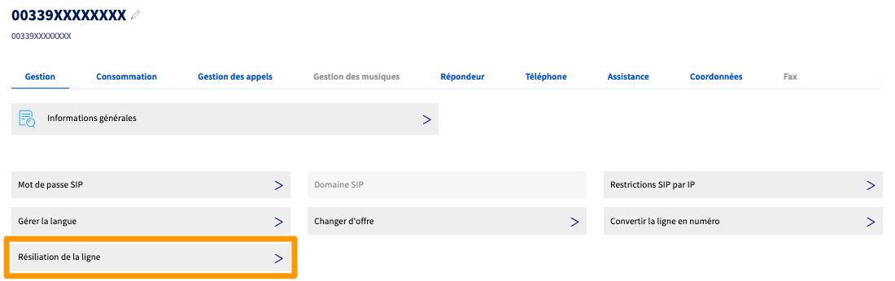
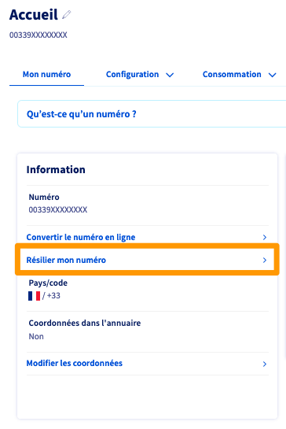
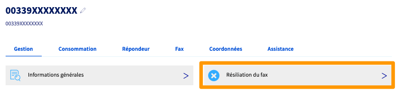

## Objectif

Ce guide décrit comment résilier une ligne Fax ou un service VoIP OVHcloud, que ce soit une ligne SIP, Trunk SIP ou un numéro alias.

**Découvrez comment résilier un services VoIP ou une ligne Fax depuis l'espace client OVHcloud.**

## Prérequis

- Disposer de [services VoIP OVHcloud](/links/telecom/telephonie-voip).
- Être connecté à votre [espace client OVHcloud](/links/manager).

## En pratique

Retrouvez dans ce guide les explications pour résilier unitairement un service VoIP ou une ligne Fax OVHcloud.

> [!primary]
> Si vous souhaitez résilier l'ensemble des services d'un groupe de téléphonie, vous pouvez supprimer ce groupe, ce qui entraînera la résiliation de tous les services qu'il contient.
>
> Retrouvez les informations correspondantes dans notre guide « [Gérer vos groupes de téléphonie](pages/web_cloud/phone_and_fax/voip/regrouper_services_telephonie) ».

En fonction de votre service, référez-vous à la partie correspondante.

### Résilier une ligne SIP / Trunk

Pour résilier une ligne **SIP** ou **Trunk** OVHcloud, sélectionnez-la dans votre espace client OVHcloud puis, depuis l'onglet `Gestion`{.action}, cliquez sur `Résiliation de la ligne`{.action}.

{.thumbnail}

Prenez connaissance des informations fournies, précisez la raison de votre résiliation puis confirmez-la en cliquant sur `Résilier`{.action}.

Toute demande de résiliation sera prise en compte lors de votre prochaine facturation. Jusqu'à cette date, l'annulation d'une résiliation restera possible.

> [!warning]
> 
> Si un téléphone Plug And Phone est attaché à cette ligne, ce dernier ne fonctionnera plus et nous vous proposerons un [retour de matériel (RMA)](/pages/web_cloud/phone_and_fax/voip/deroulement_d_un_rma).
>

### Résilier un numéro alias

Pour résilier un numéro alias, sélectionnez-le dans votre espace client OVHcloud puis, depuis l'onglet `Mon numéro`{.action}, cliquez sur `Résilier mon numéro`{.action}.

{.thumbnail}

Prenez connaissance des informations fournies, précisez la raison de votre résiliation puis confirmez-la en cliquant sur `Résilier`{.action}.

Toute demande de résiliation sera prise en compte lors de votre prochaine facturation. Jusqu'à cette date, l'annulation d'une résiliation restera possible.

> [!warning]
> 
> Si le numéro fait partie d'un pool de numéros, sa résiliation entraînera la résiliation de l'ensemble du pool.
>

### Résilier une ligne Fax

Pour résilier une ligne Fax OVHcloud, sélectionnez-la dans votre espace client OVHcloud puis, depuis l'onglet `Gestion`{.action}, cliquez sur `Résiliation du fax`{.action}.

{.thumbnail}

Prenez connaissance des informations fournies, précisez la raison de votre résiliation puis confirmez-la en cliquant sur `Résilier`{.action}.

Toute demande de résiliation sera prise en compte lors de votre prochaine facturation. Jusqu'à cette date, l'annulation d'une résiliation restera possible.

> [!warning]
> 
> Si un équipement de type Plug & Fax est attaché à cette ligne, ce dernier ne fonctionnera plus et nous vous proposerons un [retour de matériel (RMA)](/pages/web_cloud/phone_and_fax/voip/deroulement_d_un_rma).
>

## Aller plus loin

Échangez avec notre [communauté d'utilisateurs](/links/community).