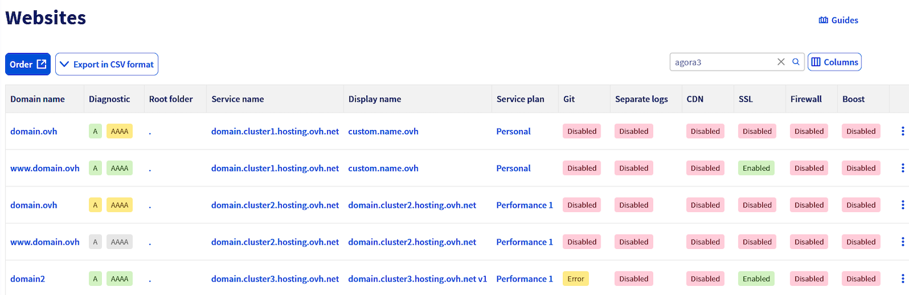

## Objetivo

La vista `Sitios web` permite centralizar la visualización de todos sus sitios web, independientemente de su alojamiento. Facilita el seguimiento de las funcionalidades activadas para cada sitio web y proporciona un acceso rápido a las acciones esenciales. Esta interfaz es especialmente útil para las agencias o los profesionales de la web que gestionan un gran número de dominios repartidos en varios alojamientos.

**Descubra cómo visualizar y gestionar todos sus sitios web desde su área de cliente.**

## Requisitos

- Estar conectado a su [área de cliente de OVHcloud](/links/manager).
- Tener un [plan de hosting](/links/web/hosting).

## Procedimiento

### Acceder a la vista `Sitios web`

Conéctese a su [área de cliente de OVHcloud](/links/manager) y acceda a `Web Cloud`{.action}. En el menú de la izquierda, haga clic en `Sitios web`{.action}. Se mostrará una tabla que recoge todos sus sitios web y su información principal.

{.thumbnail}

#### Dominio

Muestra el nombre de dominio principal del sitio web, tal y como está configurado en la pestaña Multisitio del alojamiento.

Al hacer clic, se redirige a la pestaña `Multisitio`{.action} del alojamiento correspondiente.

#### Diagnóstico

Le informa si su dominio apunta correctamente al alojamiento web asociado. Para cada dominio, se pueden obtener tres resultados de diagnóstico:

- `A/AAAA` verde: Los registros A y/o AAAA de su dominio apuntan correctamente a la dirección IP de su alojamiento web.
- `A/AAAA` amarillo: Los registros A y/o AAAA de su dominio apuntan a una dirección IP diferente de la de su alojamiento web.
- `A/AAAA` gris: No hay ningún registro A o AAAA configurado, su dominio no apunta a ninguna dirección IP.

Al hacer clic, se redirige a la pestaña `Multisitio`{.action} del alojamiento correspondiente.

Para más información sobre el diagnóstico, consulte el apartado "diagnosticar los dominios" de nuestra guía "[Alojar varios sitios web en un mismo hosting](/pages/web_cloud/web_hosting/multisites_configure_multisite)".

#### Carpeta raíz

Indica el directorio del alojamiento (por ejemplo: www, app, public_html, etc.) al que apunta el dominio.

Al hacer clic, se redirige a la pestaña `Multisitio`{.action} del alojamiento correspondiente.

#### Nombre del servicio

Nombre técnico del servicio de alojamiento web en el que está configurado el sitio web, con el formato `abcdv.clusterXX.hosting.ovh.net`.

Al hacer clic, se abrirá la pestaña `Información general`{.action} del alojamiento correspondiente.

#### Nombre mostrado

Alias personalizado definido por el cliente para identificar mejor su servicio desde el área de cliente.

Al hacer clic, se abrirá la pestaña `Información general`{.action} del alojamiento correspondiente.

#### Plan

Muestra el tipo de producto asociado al alojamiento: Starter, Personal, Profesional o Performance.

Al hacer clic, se abrirá la pestaña `Información general`{.action} del alojamiento correspondiente.

#### Git

Muestra el estado de la integración de Git en el sitio web:

- Activo: El repositorio Git está conectado.
- Inactivo: el repositorio Git no está activado.
- En curso: Se está configurando el repositorio Git.
- Error: se ha detectado un error en la configuración del repositorio Git.

Al hacer clic, se redirige a la pestaña `Multisitio`{.action} del alojamiento correspondiente.

#### Logs separados

Indica si un espacio de logs está activado en el dominio seleccionado.

Al hacer clic, se redirige a la pestaña `Multisitio`{.action} del alojamiento correspondiente.

Para más información, consulte nuestra página "[Monitorice y analice el tráfico en sus sitios web](/links/web/hosting-traffic-analysis)".

> [!warning]
>
> Los logs separados no pueden activarse para un nombre de dominio externo. Esta opción solo está disponible para los dominios registrados en OVHcloud.
>

#### CDN

Muestra el estado de la CDN (**C**Content **D**elivery **N**Network) en el dominio:

- Activo: La CDN está en funcionamiento.
- Inactivo: La CDN está desactivada.
- N/A: No aplicable (oferta no compatible).

Al hacer clic, se redirige a la pestaña `Multisitio`{.action} del alojamiento correspondiente.

La CDN permite almacenar en caché elementos estáticos del sitio web, como imágenes. Para más información, consulte nuestra página "[Shared CDN](/links/web/hosting-options-cdn)".

#### SSL

Indica si el SSL está activado o no en el dominio.

Al hacer clic, se redirige a la pestaña `Multisitio`{.action} del alojamiento correspondiente.

El SSL le permite disfrutar de una conexión segura (**https://**) en el dominio seleccionado. Para más información, consulte nuestra página "[Protege eficazmente tu sitio web de OVHcloud con un certificado SSL premium](/links/web/hosting-options-ssl)".

#### Firewall

Indica si el firewall de aplicación está habilitado en el dominio.

Al hacer clic, se redirige a la pestaña `Multisitio`{.action} del alojamiento correspondiente.

Para más información, consulte nuestra página "[Opciones imprescindibles para tu alojamiento web](/links/web/hosting-options)".

#### Boost

Indica si la opción Boost está activada o no en el alojamiento web. La opción Boost permite aumentar temporalmente los recursos de CPU y RAM de su alojamiento web.

Al hacer clic, se abrirá la pestaña `Mejorar mi plan`{.action} del alojamiento correspondiente.

Para más información sobre la opción Boost, consulte el apartado "Mejorar temporalmente su plan de hosting Performance" de nuestra guía "[Web hosting - Cómo mejorar su solución](/pages/web_cloud/web_hosting/how_to_upgrade_web_hosting_offer)".

## Más información 
 
Para servicios especializados (posicionamiento, desarrollo, etc.), contacte con [partners de OVHcloud](/links/partner).
 
Si quiere disfrutar de ayuda para utilizar y configurar sus soluciones de OVHcloud, puede consultar nuestras distintas soluciones [pestañas de soporte](/links/support).
 
Interactúe con nuestra [comunidad de usuarios](/links/community).