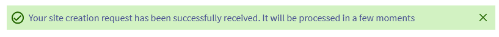
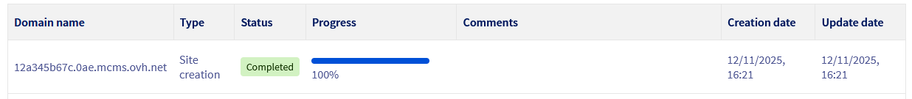
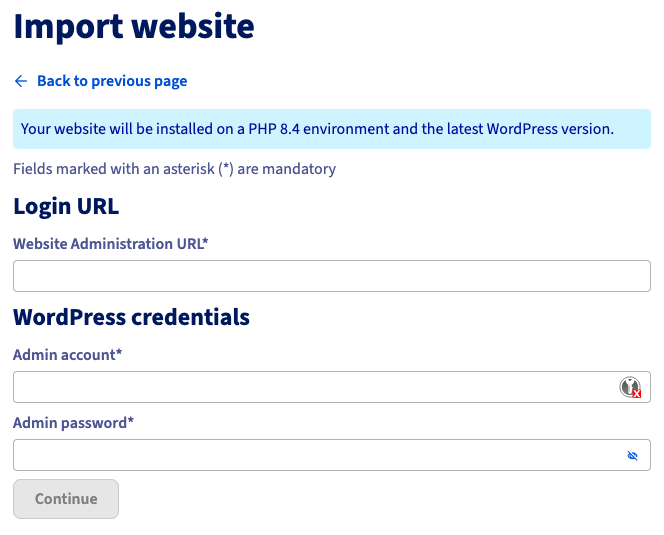
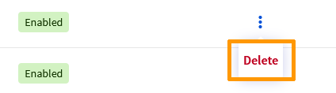
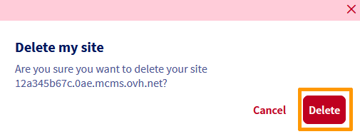
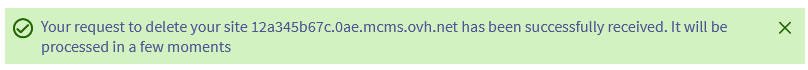
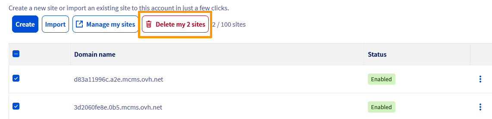

## Objectif

Le **Managed Hosting for WordPress** est une nouvelle offre OVHcloud permettant d’héberger et d’administrer vos sites web WordPress en toute simplicité. Pensé pour les professionnels, les agences et les indépendants, ce service vous libère des tâches techniques liées à la gestion de l’infrastructure et des mises à jour, afin que vous puissiez vous concentrer sur votre contenu et votre activité. Ce guide présente le concept du produit, ses principaux avantages et les fonctionnalités disponibles dans le cadre de la **phase Beta**.

## Prérequis

- Avoir accès au programme [OVHcloud Labs](https://labs.ovhcloud.com/en/managed-wp/) pour la phase Beta.
- Être connecté à l’[espace client OVHcloud](/links/manager)

## En pratique

### Présentation du produit

#### Une gestion WordPress 100 % OVHcloud

Avec Managed Hosting for WordPress, **OVHcloud s’occupe de tout** :

- Hébergement, infrastructure, cache et sécurité.
- Installation et maintenance du CMS.
- Sauvegardes et mises à jour automatiques.
- Supervision des performances et de la disponibilité.
- Gestion simplifiée des domaines, des plugins et des environnements de staging (phases Beta et GA).

Aucune connaissance serveur n’est nécessaire : tout est **accessible depuis l’espace client OVHcloud** ou via **l’API**. Vous pouvez ainsi **créer, importer et administrer vos sites WordPress en quelques clics**, sans jamais avoir à manipuler de FTP, de base de données ni de ligne de commande.

#### Une solution clé en main

Chaque site web bénéficie d’un environnement optimisé, prêt à l’emploi :

- **Installation WordPress automatique** dès la commande.  
- **Infrastructure managée** : maintenance, patchs, mises à jour logicielles et sécurité gérés par OVHcloud.  
- **Performances garanties** : cache WordPress intégré, hébergement sur infrastructure dédiée, et monitoring continu.
- **Évolutivité intégrée** : possibilité d’upgrade ou d’ajout de ressources (boost, staging, clone) selon vos besoins.
- **Compatibilité totale** : accès via l’espace client OVHcloud et l’API publique, permettant l’intégration dans vos workflows existants.

#### Une approche progressive

Le produit est actuellement disponible en **version Beta** dans le cadre du programme [OVHcloud Labs](https://labs.ovhcloud.com/en/managed-wp/). Cette première phase permet de tester les fonctionnalités essentielles :

- Création et gestion de sites WordPress managés.
- Import de sites externes.
- Mise à jour automatique du CMS et des plugins.
- Affichage du statut de vos sites web dans un tableau de bord de votre espace client.

> [!primary]
>
> D’autres fonctionnalités, comme la gestion avancée des domaines, le clonage, le staging et l’accès FTP/SSH — seront progressivement ajoutées lors des phases **Beta** et **GA (General Availability)**.

### Fonctionnalités

Connectez-vous à [l’espace client OVHcloud](/links/manager), rendez-vous dans la partie `Web Cloud`{.action} puis cliquez sur `Managed hosting for WordPress`{.action}.

#### Créer un site web

Pour créer un site web, cliquez sur le bouton `Créer`{.action}. L’écran ci-dessous s’affiche :

{.thumbnail}

Remplissez les champs du formulaire afin de définir les identifiants de votre site web WordPress :

- `Langue de l’admin WordPress`{.action} : sélectionnez la langue par défaut de l’interface d’administration.
- `Version PHP`{.action} : choisissez la version PHP souhaitée pour votre environnement WordPress.
- `E-mail de l’admin`{.action} : saisissez l’adresse e-mail de l’administrateur du site WordPress.
- `Mot de passe admin`{.action} : définissez le mot de passe associé à ce compte administrateur.

Cliquez sur `Continuer`{.action} pour valider les informations.

Vous êtes redirigé vers l’onglet `Mes sites`{.action}. En haut de l’écran, un message de confirmation s’affiche vous indiquant que la requête de votre création de site web a été prise en compte.

{.thumbnail}

Dans le tableau, une nouvelle ligne concernant votre nouveau site web apparaît :

- Colonne `Nom de domaine`{.action} : correspond au nom de domaine technique de votre site web. Il sert d’URL de staging (pré-production), permettant d’accéder à votre site web avant de l’associer à votre propre nom de domaine.
- Colonne `Statut`{.action} : indique l’état d’avancement de la création du site web. Le statut apparaît d’abord comme `En cours`{.action}, le temps que l’infrastructure soit déployée et que WordPress soit installé. Une fois votre site web opérationnel, le statut passe à `Activé`{.action}, indiquant que votre WordPress est désormais disponible en ligne via son nom de domaine technique.

{.thumbnail}

Vous pouvez également suivre la progression de la création de votre site web en cliquant sur l’onglet `Tâches`{.action}.

{.thumbnail}

#### Importer un site web

Vous pouvez importer un site web WordPress existant vers le Managed Hosting for WordPress. L’import vous permet de transférer automatiquement :

- Le contenu WordPress (articles, pages, médias).
- Les fichiers.
- La base de données.

> [!primary]
>
> L’import automatique d’un site web WordPress hébergé sur un Hébergement Web OVHcloud (mutualisé) sera disponible lors de la phase Beta.

Pour importer un site web WordPress, cliquez sur le bouton `Importer`{.action}. L’écran ci-dessous s’affiche :

{.thumbnail}

> [!primary]
>
> Un message d’information vous indique que votre site web sera installé sur un environnement utilisant une version de PHP stable (PHP 8.4 dans notre exemple) et la dernière version de WordPress, garantissant une migration vers un environnement à jour, stable et sécurisé.

Renseignez les champs du formulaire :

- `URL d’administration du site`{.action} : indiquez l’adresse utilisée pour vous connecter à l’interface d’administration de votre site web WordPress actuel, par exemple `https://www.monsite.com/wp-admin`{.action}.
- `Compte admin`{.action} : saisissez le nom d’utilisateur administrateur WordPress.
- `Mot de passe admin`{.action} : indiquez le mot de passe de l’utilisateur administrateur WordPress.

Ces informations permettent au système d’accéder à votre site web existant afin d’en extraire automatiquement les fichiers, la base de données et la configuration nécessaire.

Une fois les champs obligatoires remplis, cliquez sur `Continuer`{.action} pour lancer le processus d’import.

<!-- TODO finish this step when testing is available -->

#### Supprimer un site web

##### Supprimer un seul site web

Pour supprimer un site web, dirigez-vous dans l’onglet `Mes sites`{.action} et identifiez la ligne du tableau correspondant à votre site web. Cliquez sur le bouton `...`{.action} puis sur `Supprimer`{.action}.

{.thumbnail}

Un message de confirmation s’affiche. Cliquez sur `Supprimer`{.action} pour confirmer la suppression de votre site web.

{.thumbnail}

Vous êtes redirigé vers l’onglet `Mes sites`{.action}. En haut de l’écran, un message de confirmation s’affiche vous indiquant que le processus de suppression de votre site web est en cours.

{.thumbnail}

Lorsque votre site web est définitivement supprimé, sa ligne correspondante dans le tableau disparaît.

##### Supprimer plusieurs sites web à la fois

Pour supprimer plusieurs sites web en même temps, dirigez-vous dans l’onglet `Mes sites`{.action}. Identifiez les lignes du tableau correspondant aux sites web que vous souhaitez supprimer et cochez les cases situées à gauche. Une fois les sites web sélectionnés, cliquez sur le bouton `Supprimer mes X sites`{.action}.

{.thumbnail}

Un message de confirmation s’affiche. Cliquez sur `Supprimer`{.action} pour confirmer la suppression de vos sites web.

{.thumbnail}

Vous êtes redirigé vers l’onglet `Mes sites`{.action}. En haut de l’écran, un message de confirmation s’affiche vous indiquant que le processus de suppression de vos sites web est en cours.

{.thumbnail}

Lorsque vos sites web sont définitivement supprimés, leurs lignes correspondantes dans le tableau disparaissent.

#### Gérer ses sites web

Pour gérer tous vos sites web, dirigez-vous dans l’onglet `Mes sites`{.action} puis cliquez sur `Gérer mes sites`{.action}. Ce bouton ouvre automatiquement le gestionnaire de flotte, intégré au Managed Hosting for WordPress. Cet espace vous permet de gérer plusieurs sites web WordPress simultanément, depuis une interface unifiée.

##### Tableau de bord

Le gestionnaire de flotte est un outil de supervision et de gestion centralisée fourni automatiquement avec votre offre. Il vous permet d’administrer vos sites web WordPress managés sans avoir à vous connecter à chaque site web individuellement.

Depuis ce tableau de bord, vous pouvez notamment :

- Consulter l’état global de tous vos sites web : mises à jour disponibles, alertes, performances, sécurité.
- Gérer les mises à jour WordPress (plugins, thèmes, etc.) de manière centralisée.
- Accéder rapidement à chaque site web pour vérifier son état ou intervenir.
- Superviser les activités récentes (changements, mises à jour, synchronisations).
- Utiliser les fonctionnalités intégrées de sécurité, monitoring, sauvegardes, et analyses (dans les phases futures).

## Aller plus loin

Pour des prestations spécialisées (référencement, développement, etc.), contactez les [partenaires OVHcloud](/links/partner).

Échangez avec notre [communauté d’utilisateurs](/links/community).